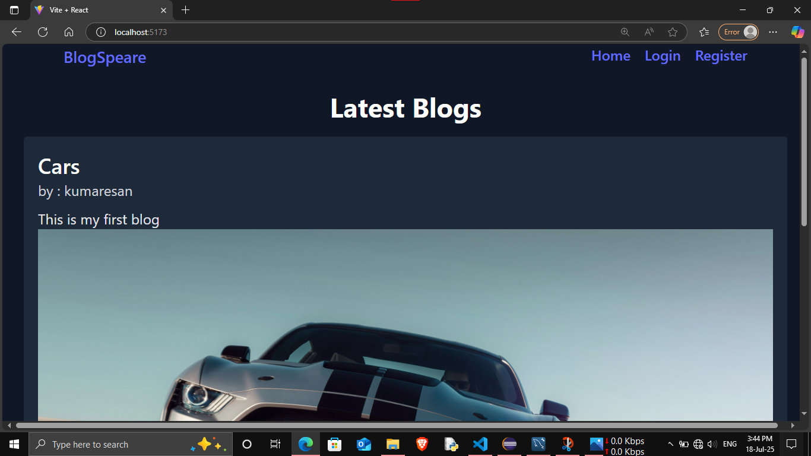
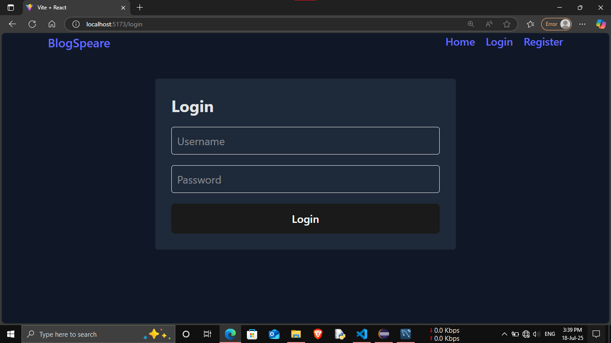
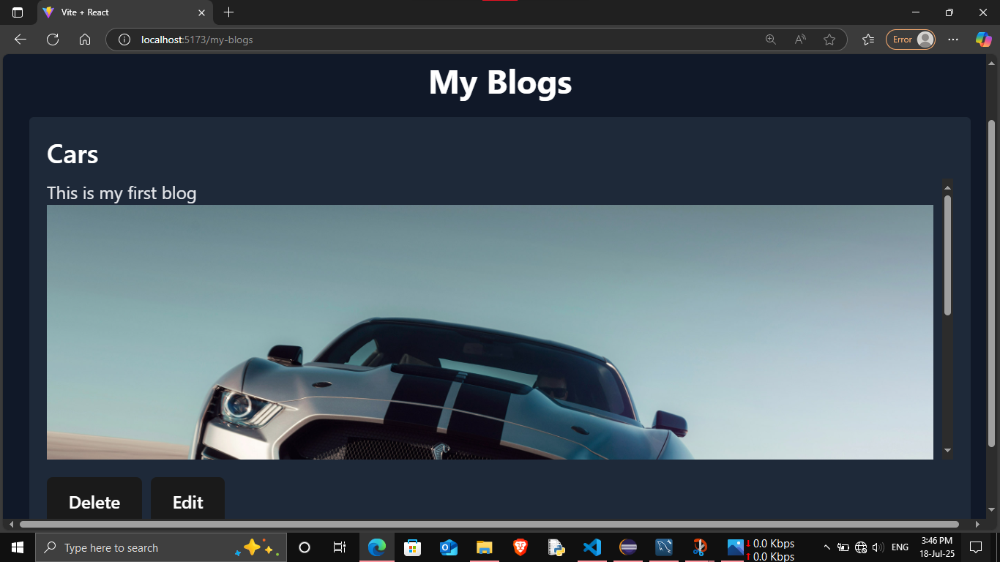
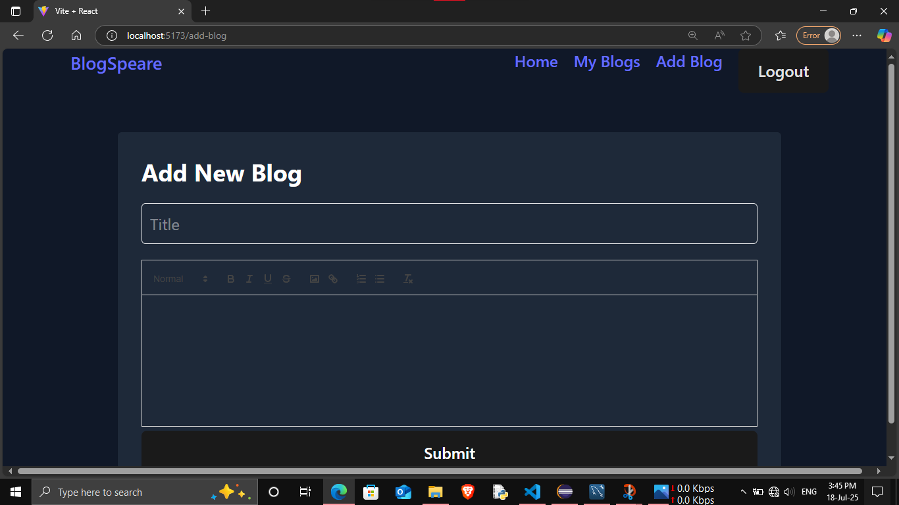
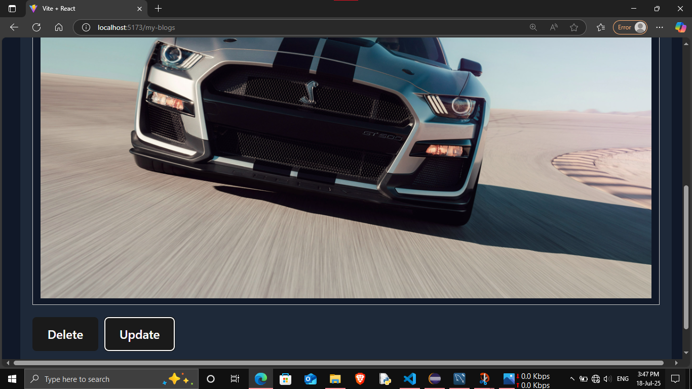
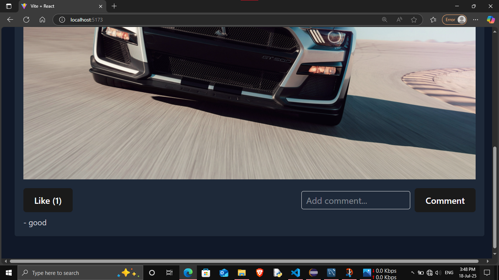

# 📝 Blogger Platform

A full-stack blogging platform where users can create, edit, and delete blog posts with rich text and images. Built using **React.js**, **Tailwind CSS**, and **Spring Boot**.

---

## 🚀 Features

### ✨ Public (Home Page)
- View all blog posts
- View blog author, content, and comments
- Like blogs
- Comment on blogs without logging in

### 🧑‍💻 Authenticated Users
- Register and log in (JWT based)
- Create blogs using a rich text editor (with image upload support)
- View **My Blogs** page
- Edit and delete own blogs
- Add images directly in blog content using the editor

---

## 🖼️ Rich Text Editor
- Integrated using **React Quill**
- Supports text formatting and image embedding
- Dark mode compatibility using Tailwind CSS

---

## 🛠️ Tech Stack

### Frontend
- React.js (with Vite) version 18 or 17 (React Quill Text editor dosen't not support for version 19) 
- Tailwind CSS
- Axios
- React Router
- React Quill (Rich Text Editor)

### Backend
- Spring Boot (Java)
- Spring Security with JWT
- MySQL database
- JPA/Hibernate

---

### Screenshots

### Home Page

### LogIn Page

### My Blog Page

### Add Blog Page

### Update & Delete

### Like & Comment


---

## 🧑‍💻 How to Run Locally

### 📦 Backend (Spring Boot)

```bash
cd backend
./mvnw spring-boot:run
